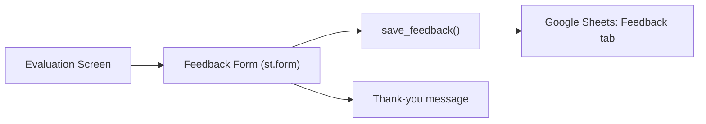

# Student Feedback Questionnaire

## Approach

Use the existing Google Sheets infrastructure (`GoogleStorage` in [google_storage.py](backend/google_storage.py)) to store feedback in a new **"Feedback"** worksheet tab. The questionnaire appears on the evaluation screen in [student_app.py](student_app.py) (and optionally [streamlit_app.py](streamlit_app.py)) right after the student sees their evaluation results.

No new dependencies needed — pure Streamlit widgets + one new method on `GoogleStorage`.

## Questionnaire Design (12 questions, ~3-5 min)

All questions are bilingual. **All data saved to Google Sheets is numeric** (1-5 for scales, 1-3 or 1-4 for multiple choice) except Q12 (open text) and the `lang` column. This makes the Feedback tab directly graph-ready without language-dependent parsing.

Multiple-choice options are shown to students as localized text but **stored as integer codes**. The key below is for our reference only.

### Questions with translations

**Usability:**

- **Q1.** The app was easy to use / האפליקציה הייתה קלה לשימוש
  - Scale 1-5: Very difficult / קשה מאוד → Very easy / קלה מאוד

**Prior Experience:**

- **Q2.** Have you ever tried "learning by teaching" before? / ?האם ניסית בעבר ללמוד דרך הוראה
  - Multiple choice (saved as 1/2/3):
    - 1 = Yes, I regularly explain concepts to others to learn / כן, אני מסביר/ה מושגים לאחרים באופן קבוע כדי ללמוד
    - 2 = Sometimes, but not intentionally / לפעמים, אך לא בכוונה
    - 3 = No, this was my first time / לא, זו הייתה הפעם הראשונה שלי
- **Q3.** How familiar were you with the topic BEFORE using the app? / ?כמה מוכר לך הנושא לפני השימוש באפליקציה
  - Scale 1-5: Never heard of it / מעולם לא שמעתי על זה → I could teach it to others / יכולתי ללמד את זה לאחרים

**Learning Experience:**

- **Q4.** The "struggling student" felt realistic and engaging / ה"תלמיד המתקשה" הרגיש מציאותי ומעניין
  - Scale 1-5: Strongly disagree / לא מסכים/ה בכלל → Strongly agree / מסכים/ה מאוד
- **Q5.** I felt challenged to think deeply about the topic / הרגשתי שאותגרתי לחשוב לעומק על הנושא
  - Scale 1-5: Strongly disagree / לא מסכים/ה בכלל → Strongly agree / מסכים/ה מאוד
- **Q6.** Teaching the "student" helped me find gaps in my own understanding / הוראת ה"תלמיד" עזרה לי לגלות פערים בהבנה שלי
  - Scale 1-5: Strongly disagree / לא מסכים/ה בכלל → Strongly agree / מסכים/ה מאוד

**Mentor:**

- **Q7.** How did you primarily use the mentor? / ?איך השתמשת בעיקר במנטור
  - Multiple choice (saved as 1/2/3/4):
    - 1 = I didn't use the mentor at all / לא השתמשתי במנטור כלל
    - 2 = Only when I got stuck / רק כשנתקעתי
    - 3 = After every explanation to check my approach / אחרי כל הסבר כדי לבדוק את הגישה שלי
    - 4 = At the beginning to plan my teaching strategy / בהתחלה כדי לתכנן את אסטרטגיית ההוראה שלי
- **Q8.** The mentor's advice was helpful for improving my explanations / העצות של המנטור עזרו לי לשפר את ההסברים שלי
  - Scale 1-5: Strongly disagree / לא מסכים/ה בכלל → Strongly agree / מסכים/ה מאוד

**Outcome:**

- **Q9.** The evaluation feedback was fair and useful / המשוב על הביצועים היה הוגן ושימושי
  - Scale 1-5: Strongly disagree / לא מסכים/ה בכלל → Strongly agree / מסכים/ה מאוד
- **Q10.** After using the app, I understand the topic better / אחרי השימוש באפליקציה, אני מבין/ה את הנושא טוב יותר
  - Scale 1-5: Strongly disagree / לא מסכים/ה בכלל → Strongly agree / מסכים/ה מאוד
- **Q11.** I would recommend this app to others for learning / הייתי ממליץ/ה על האפליקציה הזו לאחרים ללמידה
  - Scale 1-5: Strongly disagree / לא מסכים/ה בכלל → Strongly agree / מסכים/ה מאוד

**Open:**

- **Q12.** Any other feedback? / ?משוב נוסף (Optional)
  - Paragraph, helper text: "What worked well? What could be improved?" / "מה עבד טוב? מה אפשר לשפר?"

## Files to Change

### 1. [backend/google_storage.py](backend/google_storage.py)

- Add `_WS_FEEDBACK = "Feedback"` constant
- Initialize `self._feedback_ws` in `__init`__
- Add `save_feedback()` method that appends a row — all values numeric except Q12 and lang: `[session_id, timestamp, q1(1-5), q2(1-3), q3(1-5), q4(1-5), q5(1-5), q6(1-5), q7(1-4), q8(1-5), q9(1-5), q10(1-5), q11(1-5), q12(text), lang]`

### 2. [student_app.py](student_app.py)

- Add `"feedback_submitted": False` to `_init_session_state()` defaults
- Add a `_render_feedback_form()` function with `st.form` containing:
  - 8x `st.select_slider` (Linear scale 1-5) for Q1, Q3, Q4, Q5, Q6, Q8, Q9, Q10, Q11
  - 2x `st.radio` for Q2 (learning-by-teaching experience) and Q7 (mentor usage)
  - 1x `st.text_area` for Q12 (open feedback, optional)
  - Submit button that calls `GoogleStorage.save_feedback()` and sets `feedback_submitted = True`
- Insert the feedback form into `_screen_evaluation()` — show it between the evaluation results and the action buttons (Try Again / New Session / Save Results)
- After submission, show a thank-you message instead of the form

### 3. Google Sheet setup

- A new **"Feedback"** tab needs to be created in the spreadsheet with headers: `session_id | timestamp | q1_easy_to_use | q2_learning_by_teaching_exp | q3_prior_familiarity | q4_student_realistic | q5_challenged_deeply | q6_found_gaps | q7_mentor_usage | q8_mentor_helpful | q9_eval_fair | q10_understand_better | q11_recommend | q12_open_feedback | lang`
- No `student_name` column — `session_id` is sufficient to link feedback to a session; name is optional and often "anonymous"

## Data Flow

## Notes

- The form uses `st.form` to batch all inputs into a single submit, avoiding Streamlit reruns on every slider change
- Feedback is optional but encouraged — the action buttons (Try Again, New Session, Retrospective) remain accessible regardless
- `feedback_submitted` in session_state prevents double submissions
- If Google Sheets is not configured (local mode), feedback is silently skipped (same pattern as `_save_to_cloud`)
- **Multiple-choice encoding:** Q2 and Q7 are stored as integers (1-3 and 1-4 respectively), not text. Students see localized labels; the sheet gets clean numbers. The mapping key is documented only in the plan and code comments — never shown to students
- **All columns q1-q11 are numeric** — this means the entire Feedback tab (minus Q12 open text and the lang column) can be directly used for charts/analysis without any text parsing

